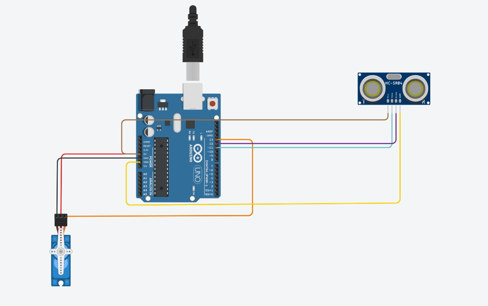

# Projeto: Catraca Controlada por Sensor Ultrassônico e Servo Motor

Este projeto foi desenvolvido como parte do trabalho prático da disciplina de **Microcontroladores e IoT**. O objetivo é construir um sistema de controle de catraca utilizando um sensor ultrassônico para detectar proximidade e um servo motor para abrir ou fechar a catraca com base na distância medida.

## Tecnologias Utilizadas
- **Arduino UNO**
- **Servo Motor**
- **Sensor Ultrassônico HC-SR04**
- **Linguagem C++** para desenvolvimento do código

## Funcionamento do Projeto
O sistema utiliza um sensor ultrassônico para medir a distância de um objeto (ou pessoa) da catraca. Quando a pessoa se aproxima, o sensor detecta a distância e, se for menor ou igual a 25 cm, o servo motor abre a catraca. Caso contrário, a catraca permanece fechada.

### Diagrama de Conexões

### Simulação no Tinkercad

Você pode acessar e simular o circuito completo diretamente no Tinkercad através do link a seguir:

[Clique aqui para visualizar a simulação no Tinkercad](https://www.tinkercad.com/things/fTG3KQ5yhpQ-catraca-inteligente/editel?returnTo=https%3A%2F%2Fwww.tinkercad.com%2Fdashboard%2Fdesigns%2Fcircuits&sharecode=NZlXFLwzzqRDXO2dfOHRDIRbh8wcDysIwQWDKuIHWdg)

### Lógica de Funcionamento
1. O sensor ultrassônico mede a distância até o objeto.
2. Se a distância for menor ou igual a **25 cm**, o servo motor gira até **180 graus**, abrindo a catraca.
3. Após **3 segundos**, a catraca retorna à posição original, girando o servo motor de volta para **90 graus**.

## Como Rodar o Projeto
1. Abra o código no **Arduino IDE** ou no **VS Code** com a extensão do Arduino instalada.
2. Conecte o Arduino ao seu computador e faça o upload do código.
3. Conecte os componentes conforme o diagrama de conexão descrito acima.
4. Abra o monitor serial para visualizar a distância medida pelo sensor ultrassônico.

## Possíveis Melhorias
- Adicionar um **display LCD** para mostrar a distância em tempo real.
- Implementar um sistema de autenticação para permitir a passagem, como RFID.
- Fazer integração com uma rede IoT para registrar o número de acessos.

## Conclusão
Este projeto demonstra a aplicação prática de sensores e atuadores com o uso de microcontroladores, integrando conceitos de **IoT** e **automação**. A simplicidade da lógica permite uma fácil adaptação e expansão para sistemas mais complexos.

---

**Aluno:** Pedro Bianco e Larissa Góis
**Disciplina:** Microcontroladores e IoT  
**Faculdade:** FMU
